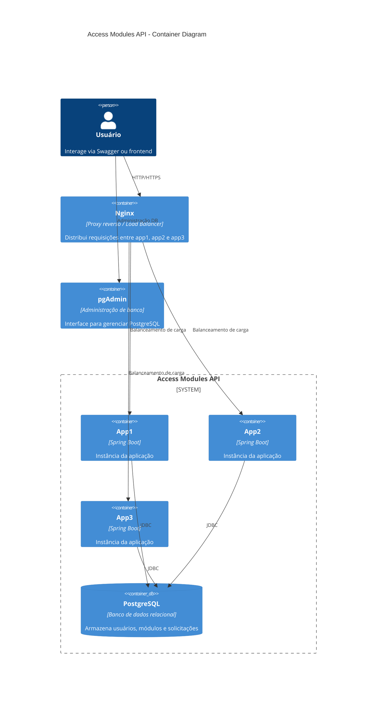

# 📌 Access Modules API

## 📖 Descrição do Projeto
API para gerenciamento de solicitações de acesso a módulos de sistema.  
Inclui autenticação via **JWT**, CRUD completo de solicitações, regras de negócio implementadas, validações e documentação via **Swagger**.

📌 **Observação:** Durante o desenvolvimento e documentação deste projeto, foi utilizado apoio de ferramentas de IA, como o **Copilot**, para otimizar a escrita da documentação e garantir clareza na explicação técnica.

---

## 🛠️ Tecnologias Utilizadas
- **Java 21**
- **Spring Boot 3.x**
- **Spring Security (JWT)**
- **Spring Data JPA**
- **PostgreSQL 17**
- **Liquibase**
- **Docker & Docker Compose**
- **NGINX (Load Balancer)**
- **JaCoCo (Cobertura de testes)**
- **Swagger/OpenAPI**

---

## 📋 Pré-requisitos
- **Docker** ≥ 20.x  
- **Docker Compose** ≥ 2.x  

---

## 🚀 Como executar localmente com Docker
```bash
# Build e subir containers em background
docker compose up --build -d

# Parar containers
docker compose stop

# Reiniciar containers
docker compose start

# Resetar completamente o ambiente
docker compose down -v
```

A aplicação estará disponível em:  

Swagger:  
👉 `http://localhost:8080/swagger-ui.html`

---

## 🧪 Como executar os testes e gerar relatório JaCoCo
```bash
./mvnw clean verify
```

---

## 📊 Como visualizar relatório de cobertura (JaCoCo)
Após rodar os testes, o relatório estará disponível em:  
👉 `target/site/jacoco/index.html`  

Além disso, o relatório em **PDF** está incluído no repositório para consulta.

---

## 🔑 Credenciais para teste

Usuários pré-configurados (senha padrão `admin`, criptografada com BCrypt):

| Email                  | Senha | Role       |
|------------------------|-------|------------|
| financeiro@empresa.com | admin | FINANCEIRO |
| rh@empresa.com         | admin | RH         |
| operacoes@empresa.com  | admin | OPERACOES  |
| ti@empresa.com         | admin | TI         |

<br>

- **pgAdmin**:  
  - URL: `http://localhost:5050`  
  - Usuário: `admin@admin.com`  
  - Senha: `admin`  

- **Banco de dados (Postgres)**:  
  - DB: `accessdb`  
  - User: `accessuser`  
  - Password: `accesspass`  

---

## 🔐 Login e Autorização no Swagger

A API utiliza **JWT Bearer Token** para proteger os endpoints.  
O Swagger UI já está configurado com o botão **Authorize**.

### Passo a passo
1. Acesse o Swagger UI:  
   👉 `http://localhost:8080/swagger-ui.html`
2. Faça login pelo endpoint `/auth/login` com um dos usuários de teste:
   ```http
   POST /auth/login
   Content-Type: application/json

   {
     "email": "financeiro@empresa.com",
     "password": "admin"
   }
   ```
3. A resposta conterá o campo `token`:
   ```json
   {
     "token": "eyJhbGciOiJIUzI1NiIsInR5cCI6...",
     "email": "financeiro@empresa.com",
     "role": "FINANCEIRO"
   }
   ```
4. Copie apenas o valor do **token** (sem o prefixo `Bearer`).  
   O Swagger já completa automaticamente com `Bearer <token>` quando você cola no modal **Authorize**.
5. Clique em **Authorize** → cole o token → clique em **Login**.
6. Após autorizado, todos os endpoints protegidos poderão ser testados diretamente pelo Swagger.

### 🔄 Trocar de usuário
- Para logar com outro usuário, basta clicar novamente em **Authorize**, depois em **Logout**, e repetir o processo de login com novas credenciais.

✅ **Dica:**  
- Se o login falhar, o endpoint retorna:
  ```json
  "Usuário não encontrado"
  ```
  ou
  ```json
  "Credenciais inválidas"
  ```

---

## 📡 Exemplos de requisições

### ➕ Criar Solicitação
```http
POST /solicitations
Authorization: Bearer <token>
Content-Type: application/json

{
  "moduleIds": [1, 2],
  "justificativa": "Necessário para realizar atividades do meu departamento",
  "urgente": true
}
```

**✅ Resposta de Sucesso**

```json
[
  {
    "protocolo": "SOL-20251125-0001",
    "status": "ATIVO",
    "justificativa": "Necessário para realizar atividades do meu departamento",
    "urgente": true,
    "userId": 10,
    "userEmail": "financeiro@empresa.com",
    "moduleId": 1,
    "moduleName": "Gestão Financeira"
  },
  {
    "protocolo": "SOL-20251125-0002",
    "status": "NEGADO",
    "justificativa": "Necessário para realizar atividades do meu departamento",
    "urgente": true,
    "userId": 10,
    "userEmail": "financeiro@empresa.com",
    "moduleId": 2,
    "moduleName": "Aprovador Financeiro",
    "motivo": "Módulo incompatível com outro módulo já ativo em seu perfil"
  }
]
```

**❌ Resposta de Erro**
```json
[
  {
    "mensagem": "Solicitação negada",
    "motivo": "Departamento sem permissão para acessar este módulo",
    "moduleId": 3,
    "moduleName": "Gestão de Estoque"
  }
]
```
---

### 📋 Listar Solicitações com Filtros
```http
GET /solicitations?status=ATIVO&userId=10&urgente=true
Authorization: Bearer <token>
```

**Resposta**
```json
[
  {
    "protocolo": "SOL-20251125-0001",
    "status": "ATIVO",
    "justificativa": "Necessário para trabalho",
    "urgente": true,
    "userId": 10,
    "userEmail": "financeiro@empresa.com",
    "moduleId": 1,
    "moduleName": "Gestão Financeira"
  }
]
```

---

### 🔎 Buscar Solicitação por Protocolo
```http
GET /solicitations/SOL-20251125-0001
Authorization: Bearer <token>
```

**Resposta**
```json
{
  "protocolo": "SOL-20251125-0001",
  "status": "ATIVO",
  "justificativa": "Necessário para trabalho",
  "urgente": true,
  "userId": 10,
  "userEmail": "financeiro@empresa.com",
  "moduleId": 1,
  "moduleName": "Gestão Financeira"
}
```

---

### ❌ Cancelar Solicitação
```http
PATCH /solicitations/SOL-20251125-0001/cancel
Authorization: Bearer <token>
Content-Type: application/json

{
  "reason": "Solicitação não é mais necessária"
}
```

**Resposta**
```json
{
  "protocolo": "SOL-20251125-0001",
  "status": "CANCELADO",
  "cancelReason": "Solicitação não é mais necessária"
}
```

---

### 🔄 Renovar Solicitação
```http
PATCH /solicitations/SOL-20251125-0001/renew
Authorization: Bearer <token>
```

**Resposta**
```json
{
  "protocolo": "SOL-20251125-0002",
  "status": "ATIVO",
  "justificativa": "Necessário para trabalho",
  "urgente": true,
  "userId": 10,
  "userEmail": "financeiro@empresa.com",
  "moduleId": 1,
  "moduleName": "Gestão Financeira"
}
```

---

## 🏗️ Arquitetura da solução
- **3 instâncias da aplicação** rodando em paralelo (`app1`, `app2`, `app3`)  
- **NGINX** configurado como **Load Balancer**  
- **PostgreSQL 17** como banco de dados  
- **pgAdmin** para administração  
- Rede Docker `appnet` conectando todos os serviços  

Fluxo simplificado:
```
Cliente → NGINX (LB) → app1/app2/app3 → PostgreSQL
```
### 📐 Diagrama C4 (nível Container)

---

## ⚙️ Decisões Técnicas Relevantes
- Uso de **Java 21** para explorar recursos modernos da linguagem.  
- **Liquibase** para versionamento do banco:  
  - Todos os perfis (`dev`, `test`, `prod`) configurados com contexts (`setup`, `seed`).  
  - O perfil `prod` também carrega dados iniciais conforme exigido no teste técnico.  
  - Uso de **labels** e **contexts** nos `databaseChangeLog` para facilitar filtragem e execução seletiva de migrations.  
  - Apenas o container `app1` executa Liquibase (`SPRING_LIQUIBASE_ENABLED=true`), evitando concorrência entre instâncias.  
- **Perfis de Configuração (Spring Profiles)**:
  - `dev`: perfil **default**, usado para desenvolvimento local.  
  - `test`: selecionado automaticamente nos ambientes de teste.  
  - `prod`: configurado com variáveis de ambiente que sobem junto com o Docker, sem necessidade de seleção manual.  
  - Arquivo `application.properties` principal centraliza as configurações, e cada perfil herda/ajusta conforme necessário.  
- **Variáveis de ambiente definidas no Docker Compose**:
  - Banco de dados: `POSTGRES_DB`, `POSTGRES_USER`, `POSTGRES_PASSWORD`.  
  - Aplicação: `SPRING_PROFILES_ACTIVE`, `DB_URL`, `DB_USERNAME`, `DB_PASSWORD`.  
  - Segurança: `JWT_SECRET` (mínimo 32 caracteres / 256 bits) e `JWT_EXPIRATION` (default: 900000 ms = 15 min).  
  - Administração: `PGADMIN_DEFAULT_EMAIL`, `PGADMIN_DEFAULT_PASSWORD`.  
- **JWT configurado via variáveis de ambiente**, com **valores default** para facilitar execução local e sobrescritos em produção pelo Docker Compose. 
- **Nginx** como proxy reverso e balanceador de carga:  
  - Distribui requisições entre `app1`, `app2`, `app3`.  
  - Configuração de *failover* (`max_fails`, `fail_timeout`) para marcar instâncias indisponíveis.  
  - Preservação de headers do cliente (IP real, host, protocolo).  
  - Logs de acesso e erro configurados.  
  - Timeouts definidos para evitar requisições penduradas. 
- **Docker multi-stage build** para otimizar tamanho da imagem.  
- **Testes unitários e de integração** com cobertura ≥ 80% (validado via JaCoCo).  
- **Swagger/OpenAPI** para documentação e testes dos endpoints.  

---
## 📄 ADRs (Architecture Decision Records)

### ADR-001: Uso de Liquibase para versionamento do banco
- **Contexto:** Necessidade de versionar estrutura e popular dados iniciais em todos os ambientes (dev, test, prod).  
- **Decisão:** Utilizar **Liquibase** com contexts (`setup`, `seed`) e labels para separar criação e carga inicial.  
- **Consequências:**  
  - Positivas: versionamento rastreável, dados consistentes, fácil manutenção.  
  - Negativas: exige disciplina na criação de migrations.

---

### ADR-002: JWT configurado via variáveis de ambiente
- **Contexto:** Necessidade de proteger endpoints e evitar exposição de segredos no código.  
- **Decisão:** Configurar `jwt.secret` e `jwt.expiration` via variáveis de ambiente, com valores default para execução local.  
- **Consequências:**  
  - Positivas: segurança reforçada, flexibilidade entre ambientes.  
  - Negativas: exige configuração correta no Docker Compose/infra.

---

### ADR-003: Nginx como Load Balancer
- **Contexto:** Necessidade de distribuir requisições entre múltiplas instâncias da aplicação e garantir alta disponibilidade.  
- **Decisão:** Utilizar **Nginx** como proxy reverso e balanceador de carga, configurado com failover simples (`max_fails`, `fail_timeout`).  
- **Consequências:**  
  - Positivas: balanceamento funcional, logs centralizados, preservação de headers do cliente.  
  - Negativas: não inclui estratégias avançadas de balanceamento (ex: least_conn), mas atende ao escopo do projeto.

---

### ADR-004: Docker multi-stage build
- **Contexto:** Necessidade de otimizar tamanho da imagem e separar etapas de build e execução.  
- **Decisão:** Implementar **multi-stage build** no Dockerfile para compilar a aplicação e gerar imagem final enxuta.  
- **Consequências:**  
  - Positivas: imagens menores, deploy mais rápido, menos consumo de recursos.  
  - Negativas: exige configuração inicial mais detalhada no Dockerfile.
---
